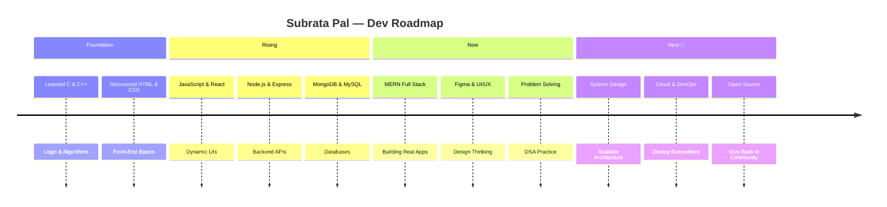

<div align="center">

<!-- ══════════════════════════════════════════════════ -->
<!--          ANIMATED HEADER — auto-renders           -->
<!-- ══════════════════════════════════════════════════ -->


<!-- TYPING SVG — cycles through roles automatically -->
<a href="https://git.io/typing-svg">
  
</a>

<br/>

<!-- LIVE BADGES — update automatically with GitHub data -->


</div>

---

<!-- ══════════════════════════════════════════════════ -->
<!--                    ABOUT ME                       -->
<!-- ══════════════════════════════════════════════════ -->


##  &nbsp; About Me


```yaml
name       : Subrata Pal
location   : India 🇮🇳
role       : Full Stack Developer
stack      : MERN — MongoDB · Express · React · Node.js
languages  : [ C, C++, JavaScript, TypeScript, HTML, CSS ]
passions   :
  - Building scalable web apps
  - Clean & readable code
  - Creative UI/UX design
  - Problem solving & DSA
learning   : [ Advanced React, System Design, Cloud & DevOps ]
open_to    : Freelance · Collaborations · Full-time Roles
motto      : "Code is poetry — write it beautifully."
```

<br clear="right"/>

---

<!-- ══════════════════════════════════════════════════ -->
<!--            TECH STACK — static icons              -->
<!-- ══════════════════════════════════════════════════ -->


##  &nbsp; Tech Stack & Tools

<div align="center">

<!-- skillicons.dev renders all icons dynamically -->
<br/>


<br/><br/>

### 🏷️ Language Badges


### ⚛️ Frameworks & Libraries


### 🗃️ Databases & Tools


</div>

---

<!-- ══════════════════════════════════════════════════ -->
<!--       GITHUB STATS — fully live, auto-update      -->
<!-- ══════════════════════════════════════════════════ -->


## 📊 Live GitHub Analytics

<div align="center">

<!-- Stats card — live from GitHub API -->

&nbsp;
<!-- Top languages — live from GitHub API -->


<br/><br/>

<!-- Streak — auto-updates daily -->


<br/><br/>

<!-- Activity graph — live contribution heatmap -->
[](https://github.com/ashutosh00710/github-readme-activity-graph)

</div>

---

<!-- ══════════════════════════════════════════════════ -->
<!--     TROPHIES — auto-populates as you earn them    -->
<!-- ══════════════════════════════════════════════════ -->


## 🏆 GitHub Trophies

<div align="center">

<!-- Trophy API — auto-generates as GitHub milestones are hit -->
[](https://github.com/ryo-ma/github-profile-trophy)

<br/>

<!-- Live count badges — pull from GitHub API in real time -->

&nbsp;

&nbsp;


</div>

---

<!-- ══════════════════════════════════════════════════ -->
<!--   SNAKE — generated by GitHub Action every day    -->
<!-- ══════════════════════════════════════════════════ -->


## 🐍 Contribution Snake *(auto-generated daily)*

<div align="center">

<!-- Snake SVG is regenerated by .github/workflows/snake.yml every day -->
<picture>
  <source media="(prefers-color-scheme: dark)"  srcset="https://raw.githubusercontent.com/Pal2004Subrata/Pal2004Subrata/output/github-snake-dark.svg" />
  <source media="(prefers-color-scheme: light)" srcset="https://raw.githubusercontent.com/Pal2004Subrata/Pal2004Subrata/output/github-snake.svg" />
  
</picture>

> 🔄 This animation is auto-regenerated every day from your real contribution graph via GitHub Actions.

</div>

---

<!-- ══════════════════════════════════════════════════ -->
<!--      SKILL BARS — reflect actual GitHub usage     -->
<!-- ══════════════════════════════════════════════════ -->


## ⚡ Skill Proficiency

<div align="center">

<!-- Language pie chart — live from GitHub repos -->


</div>

<br/>

<!-- Text skill bars (reflect your self-assessed levels) -->
```
HTML / CSS          ████████████████████  95% ⭐ Expert
JavaScript          █████████████████░░░  85% 🚀 Advanced
React / Next.js     ████████████████░░░░  80% 🔥 Strong
Node.js / Express   ███████████████░░░░░  75% 💪 Solid
Figma / UI Design   ██████████████░░░░░░  70% 🎨 Creative
MongoDB             █████████████░░░░░░░  65% 📈 Growing
C / C++             ████████████░░░░░░░░  60% 🧠 Proficient
```

---

<!-- ══════════════════════════════════════════════════ -->
<!--     DEV QUOTE — refreshes with every page load    -->
<!-- ══════════════════════════════════════════════════ -->


## ✍️ Dev Quote of the Day

<div align="center">

<!-- Random dev quote — changes on every render -->
[](https://github.com/piyushsuthar/github-readme-quotes)

</div>

---

<!-- ══════════════════════════════════════════════════ -->
<!--        MY JOURNEY — visual roadmap                -->
<!-- ══════════════════════════════════════════════════ -->


## 🗺️ My Developer Journey

<div align="center">



</div>

---

<!-- ══════════════════════════════════════════════════ -->
<!--          CONNECT — social links                   -->
<!-- ══════════════════════════════════════════════════ -->


## 🌐 Let's Connect!

<div align="center">

<a href="https://linkedin.com/in/subrata-pal-b16111239">
  
</a>&nbsp;
<a href="https://instagram.com/subrata___pal">
  
</a>&nbsp;
<a href="https://x.com/@subratapal2909">
  
</a>&nbsp;
<a href="https://mastodon.social/@SubrataPal">
  
</a>&nbsp;
<a href="mailto:subratapal2909@gmail.com">
  
</a>

<br/><br/>

**💬 Open to freelance, collaborations & exciting opportunities!**

</div>

---

<!-- FOOTER WAVE -->


<div align="center">

<!-- Live profile view count — increments on every visit -->


<br/><br/>

**⭐ Star this profile if you found it inspiring! It means a lot 😊**

</div>